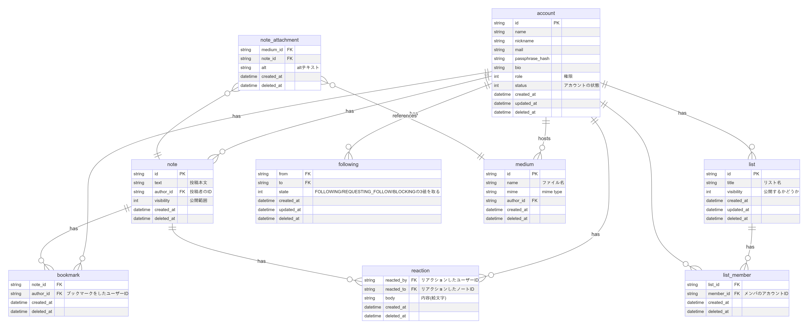
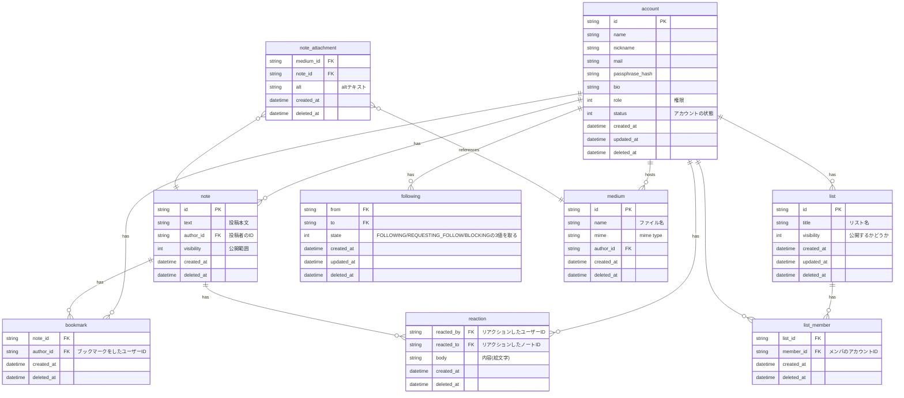

# ER図 (WIP)

Mermaid code

----

- 未定義リスト
  - リノートの扱い
    1. notesがrenoteに対してリレーションを持つようにする
    2. notesにrenote先のIDを持たせる
  - 登録中アカウント用のテーブルを作るか否か
  - アカウント(同士の)関係

> [!NOTE]
>
> ドライブが階層構造などを持たないという仕様になった上, 一旦これ以上は複雑化させない方針になっているのでメディアが直接アカウントに紐づく形になっています.

> [!IMPORTANT]
>
> CONSIDERATIONS:
>
> - [x] `note_attachements` との関連は多対多になるかも?
> - [ ] accounts に bookmarks が直接関連しているのは正しいのか?
