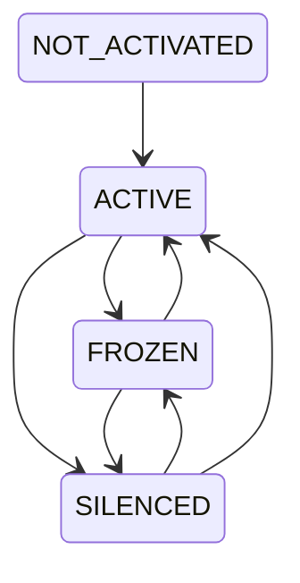
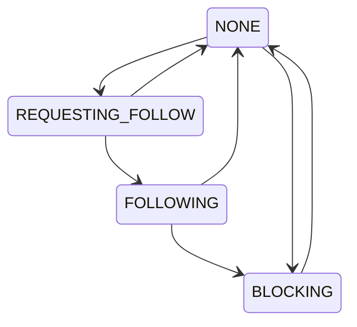

# モデルリファレンス

## ID

Twitter の Snowflake をベースに, 次のようなビットフィールド
(図はビッグエンディアン) からなる 64 ビット整数です.

先頭に時刻を含んでいるため, そのまま時刻順にソートが可能です.

```json
111111111111111111111111111111111111111111 1111111111 111111111111
64                                         22         12          0
timestamp                                  worker id  incremental
```

各ビットフィールドの意味は以下のとおりです.

| フィールド  | ビット範囲 | 意味                                                                                                                                           |
| ----------- | ---------- | ---------------------------------------------------------------------------------------------------------------------------------------------- |
| timestamp   | [64, 22)   | Pulsate エポックからのミリ秒数. エポックは 2022 年 1 月 1 日 0 時 0 分 0.000 秒. UNIX 時間のミリ秒に 1640995200000 を足すことでこれに変換可能. |
| worker id   | [22, 12)   | この ID を生成したワーカーの識別子                                                                                                             |
| incremental | [12, 0)    | ワーカーにて同一時刻で ID を生成する度に増える値                                                                                               |

TypeScript 上ではこのような型として表現します. 型引数によりエンティティ間で ID
を取り違えるようなミスを防ぎます.

```ts
declare const snowflakeNominal: unique symbol;
export type ID<T> = string & { [snowflakeNominal]: T };
```

## 認証トークン

[JSON Web Token](https://datatracker.ietf.org/doc/html/rfc7519) の一種で,
ペイロードには [更新トークン](#更新トークン) など以下の情報を含みます.

更新トークンも JWT なので, JWT がネストしています.

- `sub`: 発行対象のアカウント名
- `iat`: 発行時刻 (UNIX エポックの秒数)

```json
{
  "sub": "hogehoge-user",
  "iat": 1640995201
}
```

このトークンの有効期限は発行時刻から 15 分 (900 秒) です.

生成や検証の自作は実装ミスによる脆弱性を誘発しますのでライブラリを利用します.

## 更新トークン

[JSON Web Token](https://datatracker.ietf.org/doc/html/rfc7519) の一種で,
ペイロードには以下の情報を含みます.

```json
{
  "sub": "3e1644833000002",
  "iat": 1640995201
}
```

このトークンの有効期限は発行時刻から 30 日 (2,592,000 秒) です.
特に再発行はされず, 手動でのログイン時にのみ発行されます.

なおこのトークンは長命なので,
利用後に無効化しておかないと奪取されて再利用されるリスクがあります.
危険度は高いですがネットワーク上に流れることがほとんどないため,
このリスクには対処せず保有することにします.

## 連合

このシステムが実際に稼働しているプロセスを表すものです. この連合 (つまり Pulsate
サーバーのインスタンス) は次の属性を持ちます.

- `id`: すべての連合において一意な [ID](#id)
- `origin`: オリジン
- `name`: 名称
- `description`: 説明
- `version`: (ソフトウェア)バージョン
- `software_name` : ソフトウェア名
- `extensions`: 拡張対応リスト
- `maintainer_name` : 管理者名

## アカウント

自然人, 団体, ボットなど,
このシステム上でオブジェクトを発行する主体となるものです.
これは次の制約を持つ属性を備えます.

- `name`: アカウント名
  - 1 文字以上の URL 安全な ASCII 文字からなる
- `nickname`: 表示名, アカウントの表示に用いる自然言語の名称
  - 初期値は空文字列
  - 空文字列の場合はアカウント名にフォールバックする
  - RTL 制御文字を除く任意の `UTF-8` シーケンス
- `created_at`: このアカウントが作成された時刻
- `mail`: メールアドレス
  - 有効なメールアドレスであることが検証済み
- `passphrase_hash`: パスフレーズのハッシュ
  - 元となったパスフレーズは以下の性質を満たします
    - 文字種は正規化された `UTF-8` シーケンス
    - 連続する空白タイプの文字 (スペース, タブ, 全角スペース, 改行文字など) は 1
      つの半角スペースへと置き換えられる
    - 長さは Unicode スカラー値で 8 つぶん以上
- `salt`: パスフレーズのハッシュに使ったソルト
  - パスフレーズの平文にこれを連結したもののハッシュは, `passphrase_hash`
    に等しい

なお, 基本情報はアカウント ID に関連付けられるようにし,
このモデル自体は基本情報を保持しません.

### アカウント状態


<details>

<summary>Mermaid code</summary>



</details>

## 登録中アカウント

まだ実際にアカウントが発行されておらず,
メールアドレスを検証するスキームに入れられているアカウントです.
アカウントに加えて次の属性を持っており,
このアカウントは通常のアカウントとは別の領域に永続化されます.

- `state`: メールアドレスの検証のために `mail` へと送信した暗号学的乱数

なお, 登録中アカウントが追加されてから 168 時間(7days)
が経過したものは無効とみなします.

## アカウント関係

アカウントが他のアカウントに対してどのような関係性を持っているかを表すステートマシンです.
あるアカウントから他のアカウントに対しては次のような関係が存在します.

- `NONE`: なし
- `REQUESTING_FOLLOW`: フォローリクエスト中
- `FOLLOWING`: フォロー中
- `BLOCKING`: ブロック中

そしてこれらの関係は次の遷移図のように遷移できます.


<details>

<summary>Mermaid code</summary>



</details>

## 検索述語

タイムラインの設定や検索クエリに用いられる組み合わせ可能な述語です.
これは後述の検索命題を用いて帰納的に構成されます.

- `Atom`: 原子式で, ある検索命題をそのまま述語とします.
- `Not`: 論理否定です.
  ある検索述語によって選択されなかったもののみを選択する述語です.
- `And`: 論理積です. 2
  つの検索述語の両方によって選択されたものを選択する述語です.
- `Or`: 論理和です. 2
  つの検索述語のいずれか一方または両方によって選択されたものを選択する述語です.
- `Xor`: 排他的論理和です. 2
  つの検索述語のどちらか一方のみによって選択されたものを選択する述語です.

## 検索命題

命題は 所属, 特定のワード, ユーザー ID
などを表す次の属性のあつまりとして定義されます.
いずれの属性の条件も未設定にでき,
その場合は選択されずそのまま次の条件へと渡ります.

- `id_mask`: そのユーザー ID が完全に一致するのもだけを選択します.
- `belonging`: その投稿が所属する連合が完全一致するのもだけを選択します.
- `match_word`:
  任意の自然言語エントリに対してそのテキストが部分一致するものだけを選択します.

## メディアソース

文章, 画像, 動画などのコンテンツを効率的かつ高速に配信するオリジンおよびその
URL, その配信を提供するサービスを指します.

## 内部メディアソース

(wip)

## 外部メディアソース

(wip)

## 投稿

Pulsate に対して送信されたユーザー生成コンテンツのエンティティです.

すべての投稿は [ID](#id) を保持しています. これに加えて,
以下の属性が関連付けられます.

(wip)

# タイムライン

[アカウント関係](#アカウント関係) と [検索述語](#検索述語) をベースに,
ページネーションされた [投稿](#投稿)
のコレクションを高速に取得するためのモデルです.

まず, この Pulsate システム全体で (Redis のようなインメモリ DB 内に)
検索述語をキーとした大きな木構造を構築します. それらによる投稿 ID
コレクションのフィルタ結果が常に全アカウント間で共有されます.

その木におけるノードでは, 要素数が 1000 以下の投稿 ID コレクションを保持します.

この木の更新は,
誰かがタイムラインの作成および条件の編集を行ったタイミングで変更プランが保持され,
一定時間ごとに履行されます.

## 投稿 ID コレクション

投稿 ID コレクションは, 投稿 ID を時系列データとしてページネーション &
ランダムアクセスできるキューを実現します.
対数時間以内に挿入とクエリができるデータ構造で構築します.

タイムラインとしての投稿 ID リストを取得するときは,
そのパラメータである検索述語に最も近い ID コレクションを取得しつつ,
取得後に細かい条件で別途フィルタします.
