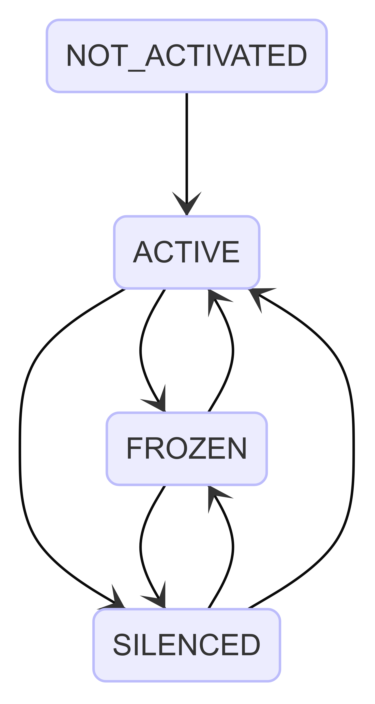
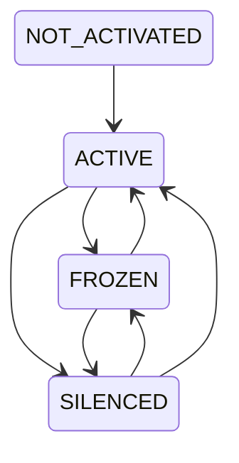
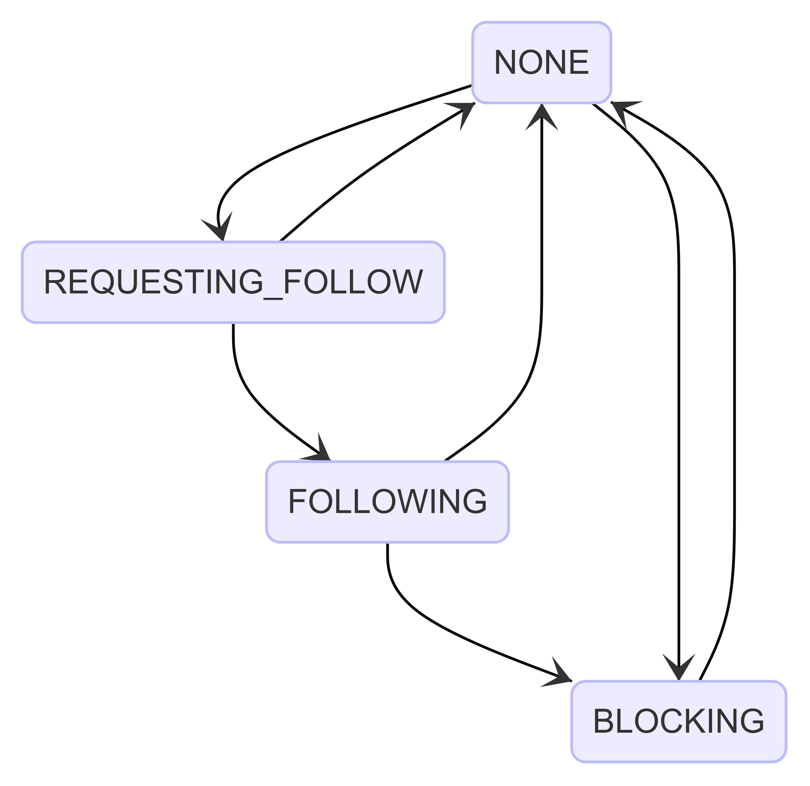
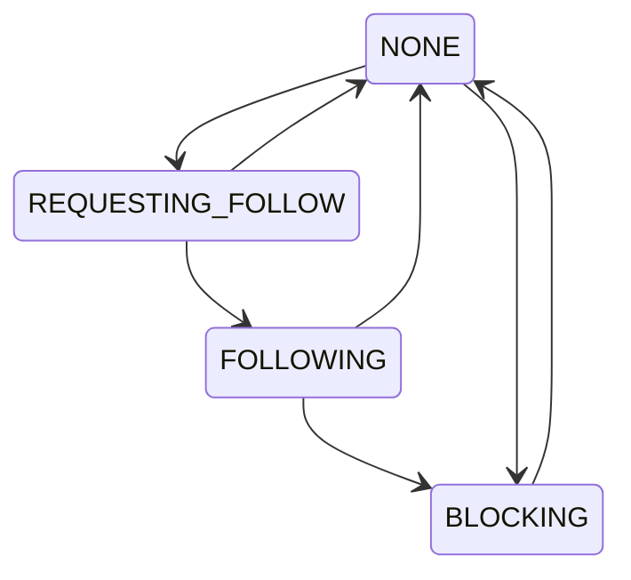

# モデルリファレンス

## ID

Twitter の Snowflake をベースに, 次のようなビットフィールド
(図はビッグエンディアン) からなる 64 ビット整数です.

先頭に時刻を含んでいるため, そのまま時刻順にソートが可能です.

```
111111111111111111111111111111111111111111 1111111111 111111111111
64                                         22         12          0
timestamp                                  worker id  incremental
```

各ビットフィールドの意味は以下のとおりです.

| フィールド  | ビット範囲 | 意味                                                                                                                                           |
| ----------- | ---------- | ---------------------------------------------------------------------------------------------------------------------------------------------- |
| timestamp   | [64, 22)   | Pulsate エポックからのミリ秒数. エポックは 2022 年 1 月 1 日 0 時 0 分 0.000 秒. UNIX 時間のミリ秒に 1640995200000 を足すことでこれに変換可能. |
| worker id   | [22, 12)   | この ID を生成したワーカーの識別子                                                                                                             |
| incremental | [12, 0)    | ワーカーにて同一時刻で ID を生成する度に増える値                                                                                               |

TypeScript 上ではこのような型として表現します. 型引数によりエンティティ間で ID
を取り違えるようなミスを防ぎます.

```ts
declare const snowflakeNominal: unique symbol;
export type ID<T> = string & { [snowflakeNominal]: T };
```
[このコードへのリンク (pkg/id/type.ts)](https://github.com/pulsate-dev/pulsate/blob/7659bb22977dbe31ac85a84d564c2cef0559492c/pkg/id/type.ts#L1-L2)

### 生成と利用の方法
#### モデル側での定義
モデルごとにこのような形でモデル固有のIDの型を定義します

```typescript
export type AccountID = ID<Account>;
```

#### ID生成方法
IDは`id`パッケージの`SnowflakeIDGenerator`クラスを利用して生成します。  

> [!IMPORTANT]
> このとき、SnowflakeIDGeneratorは必ずコンストラクタで受け取るようにしてください。
> ```typescript
> export class RegisterService {
>   /** 省略 **/
>   private readonly snowflakeIDGenerator: SnowflakeIDGenerator;
>
>   constructor(arg: {
>     /** 省略 **/
>     idGenerator: SnowflakeIDGenerator;
>   }) {
>     /** 省略 **/
>     this.snowflakeIDGenerator = arg.idGenerator;
>   }
> ```
> [このコードへのリンク (pkg/accounts/service/register.ts)](https://github.com/pulsate-dev/pulsate/blob/7659bb22977dbe31ac85a84d564c2cef0559492c/pkg/accounts/service/register.ts#L37-L56)

`SnowflakeIDGenerator.generate<T>()`メソッドを呼び出してIDを生成することができます。  
この時の型引数 T は、生成したいIDの型を入れてください
```typescript
const idRes = this.snowflakeIDGenerator.generate<AccountID>()
```

ID生成時にエラーが発生する場合があるので、必ずエラーハンドリングが必要です。

#### IDの利用方法

テストなどで利用する際にIDを静的に定義したい場合や、APIなどでユーザーからstring形式で受け取ったIDはアサーションすることでIDに変換できます。

```typescript
const accountID = "31415926535" as AccountID;
```


## 認証トークン

[JSON Web Token](https://datatracker.ietf.org/doc/html/rfc7519) の一種で,
ペイロードには [更新トークン](#更新トークン) など以下の情報を含みます.

更新トークンも JWT なので, JWT がネストしています.

- `sub`: 発行対象のアカウント名
- `iat`: 発行時刻 (UNIX エポックの秒数)

```json
{
  "sub": "hogehoge-user",
  "iat": 1640995201
}
```

このトークンの有効期限は発行時刻から 15 分 (900 秒) です.

生成や検証の自作は実装ミスによる脆弱性を誘発しますのでライブラリを利用します.

## 更新トークン

[JSON Web Token](https://datatracker.ietf.org/doc/html/rfc7519) の一種で,
ペイロードには以下の情報を含みます.

```json
{
  "sub": "3e1644833000002",
  "iat": 1640995201
}
```

このトークンの有効期限は発行時刻から 30 日 (2,592,000 秒) です.
特に再発行はされず, 手動でのログイン時にのみ発行されます.

なおこのトークンは長命なので,
利用後に無効化しておかないと奪取されて再利用されるリスクがあります.
危険度は高いですがネットワーク上に流れることがほとんどないため,
このリスクには対処せず保有することにします.

## アカウント

自然人, 団体, ボットなど,
このシステム上でオブジェクトを発行する主体となるものです.
これは次の制約を持つ属性を備えます.

- `name`: アカウント名
  - 1 文字以上の URL 安全な ASCII 文字からなる
- `nickname`: 表示名, アカウントの表示に用いる自然言語の名称
  - 初期値は空文字列
  - 空文字列の場合はアカウント名にフォールバックする
  - RTL 制御文字を除く任意の `UTF-8` シーケンス
- `created_at`: このアカウントが作成された時刻
- `mail`: メールアドレス
  - 有効なメールアドレスであることが検証済み
- `passphrase_hash`: パスフレーズのハッシュ
  - 元となったパスフレーズは以下の性質を満たします
    - 文字種は正規化された `UTF-8` シーケンス
    - 連続する空白タイプの文字 (スペース, タブ, 全角スペース, 改行文字など) は 1
      つの半角スペースへと置き換えられる
    - 長さは Unicode スカラー値で 8 つぶん以上
- `salt`: パスフレーズのハッシュに使ったソルト
  - パスフレーズの平文にこれを連結したもののハッシュは, `passphrase_hash`
    に等しい

なお, 基本情報はアカウント ID に関連付けられるようにし,
このモデル自体は基本情報を保持しません.

### アカウント状態



<details>

<summary>Mermaid code</summary>



</details>

## 登録中アカウント

まだ実際にアカウントが発行されておらず,
メールアドレスを検証するスキームに入れられているアカウントです.
アカウントに加えて次の属性を持っており,
このアカウントは通常のアカウントとは別の領域に永続化されます.

- `state`: メールアドレスの検証のために `mail` へと送信した暗号学的乱数

なお, 登録中アカウントが追加されてから 168 時間(7days)
が経過したものは無効とみなします.

## アカウント関係

アカウントが他のアカウントに対してどのような関係性を持っているかを表すステートマシンです.
あるアカウントから他のアカウントに対しては次のような関係が存在します.

- `NONE`: なし
- `REQUESTING_FOLLOW`: フォローリクエスト中
- `FOLLOWING`: フォロー中
- `BLOCKING`: ブロック中

そしてこれらの関係は次の遷移図のように遷移できます.



<details>

<summary>Mermaid code</summary>



</details>

