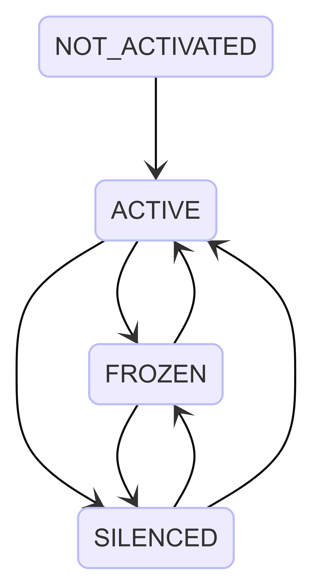
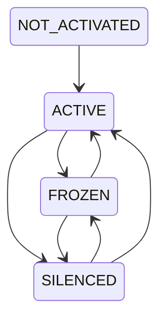
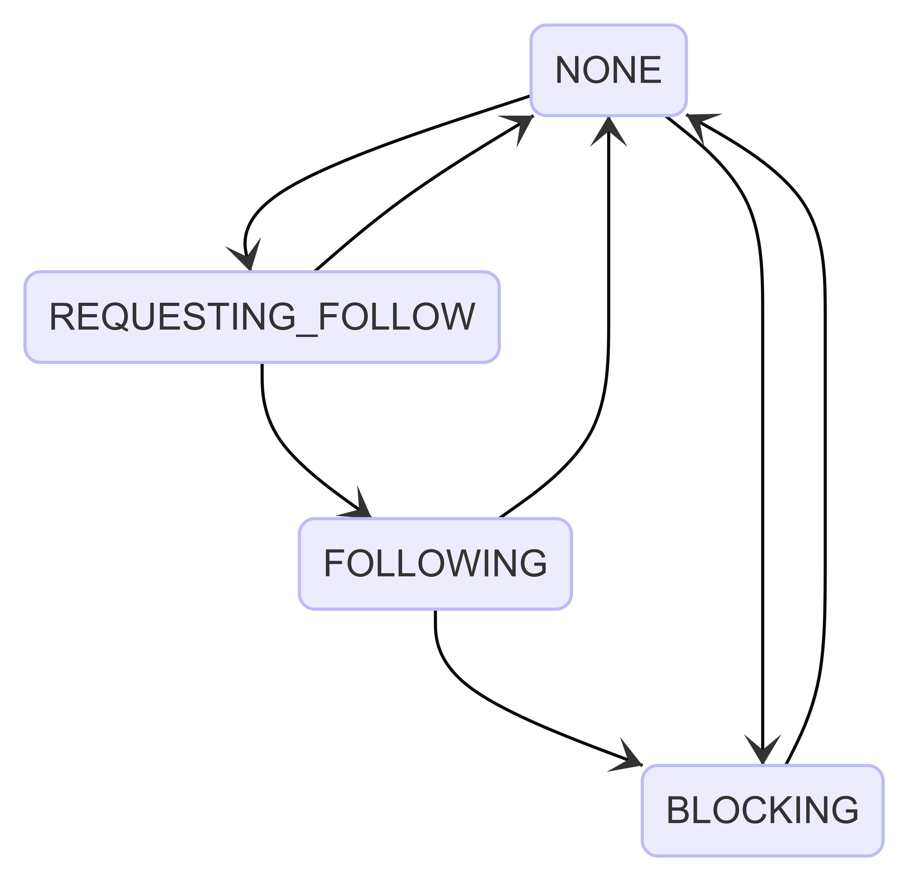
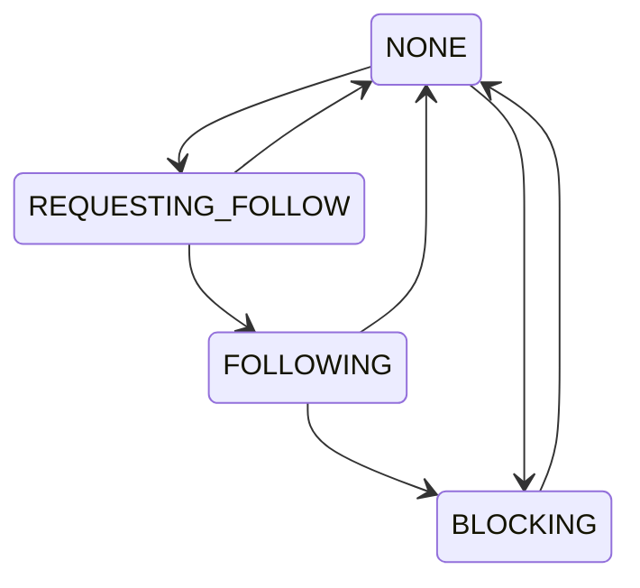

# Account モジュール

特に断りがない限り，文字列長 `L` は **以下のコードを実行して計算できる文字数**
とする．

```ts
const count = (s: string) => {
  const segmenter = new Intl.Segmenter("ja-JP", { granularity: "grapheme" });
  return [...segmenter.segment(s)].length;
};
```

## `Account`

Pulsate 上で投稿やフォローなどの行動を行う主体．
自然人・団体・ボットなど種別を問わず，このシステムでオブジェクトを発行するすべての主体が
Account として表現される．

TypeScript 上ではアカウント固有の ID 型を次のように定義する．

```typescript
export type AccountID = ID<Account>;
export type AccountName = `@${string}@${string}`;
```

Account は次の属性を持つ．

- **`id`**：AccountID
  - このアカウントを一意に識別する Snowflake ID
- **`name`**：AccountName
  - `@username@domain` の形式をとる
  - `username` は英数字で始まり，`[a-zA-Z0-9_\-.]` のみからなる
  - `domain` は RFC1035 のサブドメイン形式に従う
- **`nickname`**：表示名
  - RTL 制御文字を除く任意の UTF-8 シーケンス
  - 初期値は空文字列
  - 空文字列の場合は `name` にフォールバックして表示される
  - 文字長は `L ≦ 256`（空文字列は許容）
- **`bio`**：自己紹介文
  - 任意の UTF-8 文字列
  - 文字長は `L ≦ 1024`
- **`mail`**：メールアドレス
  - 有効なメールアドレスであることが検証済み
  - 文字長は `7 ≦ L ≦ 319`
- **`passphraseHash`**：パスフレーズのハッシュ
  - ハッシュの元となるパスフレーズは次の性質を満たす
    - 正規化された UTF-8 シーケンス
    - 連続する空白文字（スペース・タブ・全角スペース・改行文字など）は 1
      つの半角スペースに置き換えられている
    - 長さは Unicode スカラー値で 8 つぶん以上
- **`salt`**：パスフレーズのハッシュに使ったソルト
  - `passphraseHash` は，`salt`
    をパスフレーズの平文に連結したもののハッシュに等しい
- **`createdAt`**：アカウント作成日時
- **`role`**：アカウントのロール（後述の `AccountRole` を参照）
- **`frozen`**：凍結状態（後述の `AccountFrozen` を参照）
- **`silenced`**：サイレンス状態（後述の `AccountSilenced` を参照）
- **`status`**：アクティベーション状態（後述の `AccountStatus` を参照）

> [!NOTE]
> アバター画像やヘッダー画像といったプロフィール関連の基本情報は，アカウント ID
> に関連付けられた別のエンティティとして管理される． `Account`
> モデル自体はこれらを保持しない．

## `AccountRole`

Account に付与されるロール．
管理操作（凍結やサイレンスなど）を実行できるかどうかはこのロールによって決まる．

- **`normal`**：通常のアカウント
- **`moderator`**：モデレーター権限を持つアカウント
- **`admin`**：管理権限を持つアカウント

## `AccountStatus` (アクティベーション状態)

メールアドレスの検証が完了しているかを表す．

- **`notActivated`**：メールアドレスの検証が完了していない
- **`active`**：メールアドレスの検証が完了し，通常の活動が可能な状態

## `AccountFrozen` (凍結状態)

管理者によるアカウント凍結の状態を表す．
凍結されたアカウントはログインできない．

- **`normal`**：凍結されていない通常の状態
- **`frozen`**：凍結された状態

## `AccountSilenced` (サイレンス状態)

管理者によるアカウントサイレンスの状態を表す．
サイレンスされたアカウントはパブリックタイムラインへの投稿ができない．

- **`normal`**：サイレンスされていない通常の状態
- **`silenced`**：サイレンスされた状態

## アカウントのライフサイクル

`AccountStatus`，`AccountFrozen`，`AccountSilenced`
を合わせたアカウント全体のライフサイクルを次の状態図に示す．



<details>

<summary>Mermaid code</summary>



</details>

## `InactiveAccount` (登録中アカウント)

メールアドレスの検証が完了しておらず，まだ有効な Account
として発行されていない中間的なエンティティ． 通常の Account
とは別の領域に永続化される．

`InactiveAccount` は次の属性を持つ．

- **`id`**：AccountID
- **`name`**：AccountName
- **`mail`**：メールアドレス
- **`passphraseHash`**：パスフレーズのハッシュ
- **`role`**：AccountRole

> [!NOTE]
> メールアドレスの検証に用いるトークンは `InactiveAccount` モデルに含まれない．
> トークンは `AccountVerifyTokenRepository` に accountID
> と対にして別途保存される．

登録中アカウントが作成されてから 168 時間（7
日間）が経過したものは無効とみなし，削除される．

## `AccountRelationship` (アカウント関係)

あるアカウントから他のアカウントに対して成立する有向の関係を表すステートマシン．
この関係は送信側（アクター）を起点とする一方向の状態であり，相手側の状態とは独立している．



<details>

<summary>Mermaid code</summary>



</details>

各状態の意味は次のとおり．

- **`NONE`**：特定の関係がない状態
- **`REQUESTING_FOLLOW`**：フォローリクエストを送信し，相手の承認を待っている状態
- **`FOLLOWING`**：フォローしている状態
- **`BLOCKING`**：ブロックしている状態

フォロー関係の永続化エンティティは `AccountFollow`
で，フォロー元（`fromID`），フォロー先（`targetID`），作成日時（`createdAt`）を持つ．
