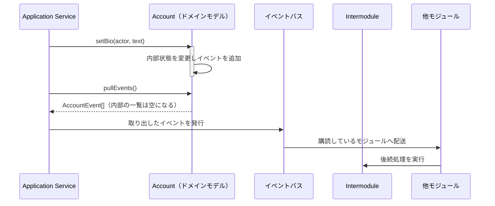
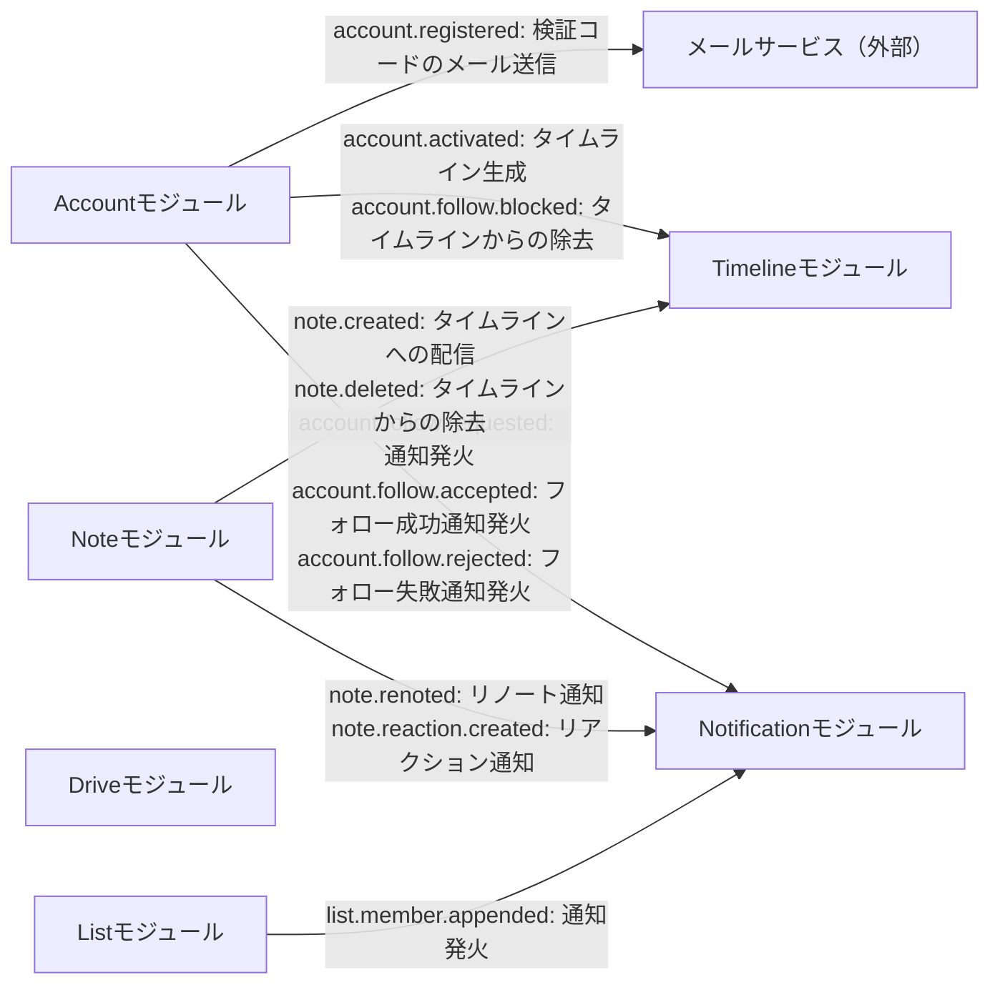

# ドメインイベント

Pulsate
は，ユーザーの操作や内部的な処理を非同期化し，リトライを可能にするためにイベント駆動アーキテクチャを採用している．

**ドメインイベント**は，操作によって生じた差分を記録し，他の処理を駆動するために必要なデータ（ペイロード）を運ぶオブジェクトである．

このページでは，モジュールごとにドメインイベントの発生条件，ペイロード，トリガーされる後続処理の一覧を示す．

## 共通のイベント形式

ドメインイベントは，次の共通フィールドを持つ．

```typescript
export type EventID = ID<DomainEvent<unknown>>;

export interface DomainEvent<Payload> {
  id: EventID;
  name: string;
  occurredAt: Date;
  version: number;
  payload: Payload;
}
```

- **`id`**：EventID
  - このイベントを一意に識別する Snowflake ID
- **`name`**：イベント名
  - `<ModuleName>.<ModelName>.<Action>`
    の形式で表される，イベントの種類を示す文字列
  - 例：`account.registered`，`note.bookmark.created`
- **`occurredAt`**：イベント発生時刻
- **`version`**：ペイロードスキーマのバージョン番号
  - `payload` の構造に後方互換性のない変更を加えたときにインクリメントする
  - 購読側はこの番号を見て，対応していないバージョンのペイロードを判別できる
- **`payload`**：イベント固有のデータ
  - 各イベントのペイロード型は `<PascalCase のイベント名>EventPayload`
    と命名する（例：`AccountRegisteredEventPayload`）

各イベントのペイロードは，操作を行ったアカウントを示すフィールドとして
**`actor`**（AccountID）を持つことを基本とする．
凍結，サイレンスなど，モデレーターが他のアカウントに対して行う操作では，`actor`
は操作を行ったモデレーター自身の AccountID
を指し，操作対象のアカウントとは別のフィールドで表す． `account.registered`
のように，イベントの結果として初めて識別される対象（`InactiveAccount`）についても，その対象自身の
AccountID を `actor` として扱う．

後続処理の一覧では，発火先を次の 2 種類で区別する．

- **（モジュール間）**：`Intermodule`
  パッケージを介して他モジュールが購読し，駆動される処理（[内部フローとモジュール間通信](../module.md)を参照）
- **（外部）**：メール送信など，システム外部のサービスと連携する処理

## ドメインモデルでの扱い

基本的にドメインモデルはドメインイベントを発行する。
ドメインイベントはドメインモデルの内部状態を変更したときに発行され、ドメインイベントの内部の状態として保持される。

```ts
class Account {
  // AccountEventsはAccountモデルで発生するDomainEventの型の集合
  #events: AccountEvent[];
  setBio(actor: AccountID, text: string) {
    // ...略
    this.#events.push(
      accountEventFactory.updateName({
        actor,
        target: this.#id,
        eventName: "account.bio.updated",
        bio: text,
      }),
    );
  }
}
```

ドメインイベントは``明示的な操作で取り出すことができる。
このとき、ドメインイベントはすべて取り出され、ドメインモデル内部には残らない。

```ts
pullEvents(): AccountEvent[] {
  // 破壊的に読み出される
  return this.#events.splice(0);
}
```

取り出されたドメインイベントは，Application
Serviceによってイベントバスに発行（publish）される．
イベントバスは非同期にイベントを配送し，購読している`Intermodule`
パッケージへ届ける．発行から後続処理までの一連の流れは，次のようになる．



## モジュール間のイベント

各イベントから後続処理への関係を，モジュール単位でまとめると次のようになる．
図中のラベルはイベント名と後続処理を示す．



## Account モジュール

### `Account`

#### `account.registered`：アカウント登録（仮登録状態）

- **発生条件**：ユーザーが登録フォームを送信し，`InactiveAccount`
  が作成されたとき
- **ペイロード**（`AccountRegisteredEventPayload`）：
  - **`actor`**：登録するアカウント自身の AccountID（`InactiveAccount` の `id`）
  - **`name`**：AccountName
  - **`mail`**：メールアドレス
- **後続処理**：
  - （外部）検証コードのメール送信

#### `account.activated`：アカウントの有効化

- **発生条件**：メールアドレスの検証が完了し，`InactiveAccount` から `Account`
  へ昇格したとき
- **ペイロード**（`AccountActivatedEventPayload`）：
  - **`actor`**：有効化されるアカウント自身の AccountID
- **後続処理**：
  - （モジュール間）タイムライン生成

#### `account.bio.updated`，`account.nickname.updated`，`account.email.updated`：プロフィール属性の更新

- 3
  つのイベントは，更新された属性が異なるだけで同じ構造を持つため，まとめて記載する．
- **発生条件**：ユーザーがプロフィール編集 API 経由で `bio`，`nickname`，`mail`
  のいずれかを更新したとき
- **ペイロード**：`actor`（AccountID，更新を行った本人）に加えて，更新後の値を 1
  件持つ
  - `account.bio.updated`（`AccountBioUpdatedEventPayload`）：**`bio`**：自己紹介文
  - `account.nickname.updated`（`AccountNicknameUpdatedEventPayload`）：**`nickname`**：表示名
  - `account.email.updated`（`AccountEmailUpdatedEventPayload`）：**`mail`**：メールアドレス

#### `account.admin.frozen`，`account.admin.unfrozen`：管理者操作によるアカウントの凍結と解除

- **発生条件**：`moderator`
  以上のロールを持つアカウントが，対象アカウントを凍結／解除したとき
- **ペイロード**（それぞれ
  `AccountAdminFrozenEventPayload`，`AccountAdminUnfrozenEventPayload`）：
  - **`actor`**：操作を行った管理者の AccountID
  - **`accountId`**：凍結／解除対象の AccountID

#### `account.admin.silenced`，`account.admin.unsilenced`：管理者操作によるサイレンス化と解除

- **発生条件**：`moderator`
  以上のロールを持つアカウントが，対象アカウントをサイレンス化／解除したとき
- **ペイロード**（それぞれ
  `AccountAdminSilencedEventPayload`，`AccountAdminUnsilencedEventPayload`）：
  - **`actor`**：操作を行った管理者の AccountID
  - **`accountId`**：サイレンス化／解除対象の AccountID

### `AccountAvatar`

#### `account.avatar.updated`：アバター設定

- **発生条件**：ユーザーがアバター画像を設定または変更したとき
- **ペイロード**（`AccountAvatarUpdatedEventPayload`）：
  - **`actor`**：AccountID
  - **`mediumId`**：設定されたメディアファイルの
    MediumID（[`Drive::Medium`](./drive.md#medium-メディアファイル)を参照）

#### `account.header.updated`：ヘッダー設定

- **発生条件**：ユーザーがヘッダー画像を設定または変更したとき
- **ペイロード**（`AccountHeaderUpdatedEventPayload`）：
  - **`actor`**：AccountID
  - **`mediumId`**：設定されたメディアファイルの MediumID

### `AccountFollow`

#### `account.follow.requested`：フォローリクエスト

- **発生条件**：あるアカウントが他のアカウントに対してフォローリクエストを送信したとき（`AccountRelationship`
  が `NONE` から `REQUESTING_FOLLOW` へ遷移したとき）
- **ペイロード**（`AccountFollowRequestedEventPayload`）：
  - **`actor`**：フォローリクエストを送信したアカウントの AccountID
  - **`targetId`**：フォローリクエストを受信したアカウントの AccountID
- **後続処理**：
  - （モジュール間）通知発火

#### `account.follow.accepted`：フォロー承認

- **発生条件**：フォローリクエストが承認されたとき（`REQUESTING_FOLLOW` から
  `FOLLOWING` へ遷移したとき）
- ここでの `actor`
  は「このイベントを実際に発生させた側」を指し，承認を行った受信側のアカウントである．[Account モジュール](./account.md)
  の `AccountRelationship`
  でいう「アクター」（関係の起点となる送信側，`fromId`）とは別の概念であり，`account.follow.requested`
  とは送信側と受信側が入れ替わる．
- **ペイロード**（`AccountFollowAcceptedEventPayload`）：
  - **`fromId`**：フォローリクエストを送信したアカウントの AccountID
  - **`actor`**：フォローリクエストを承認したアカウントの AccountID
- **後続処理**：
  - （モジュール間）フォロー成功通知発火

#### `account.follow.rejected`：フォロー拒否

- **発生条件**：フォローリクエストが拒否されたとき（`REQUESTING_FOLLOW` から
  `NONE` へ遷移したとき）
- `actor` は拒否を行った受信側のアカウントであり，`account.md`
  の「アクター」（`fromId`）とは異なる（`account.follow.accepted` と同様）．
- **ペイロード**（`AccountFollowRejectedEventPayload`）：
  - **`fromId`**：フォローリクエストを送信したアカウントの AccountID
  - **`actor`**：フォローリクエストを拒否したアカウントの AccountID
- **後続処理**：
  - （モジュール間）フォロー失敗通知発火

#### `account.follow.unfollowed`：フォロー解除

- **発生条件**：フォロー中のアカウントに対してフォローを解除したとき（`FOLLOWING`
  から `NONE` へ遷移したとき）
- **ペイロード**（`AccountFollowUnfollowedEventPayload`）：
  - **`actor`**：フォローを解除したアカウントの AccountID
  - **`targetId`**：フォローを外されたアカウントの AccountID

#### `account.follow.blocked`：ブロック操作

- **発生条件**：あるアカウントが他のアカウントをブロックしたとき（`AccountRelationship`
  が `BLOCKING` へ遷移したとき）
- **ペイロード**（`AccountFollowBlockedEventPayload`）：
  - **`actor`**：ブロックを行ったアカウントの AccountID
  - **`targetId`**：ブロックされたアカウントの AccountID
- **後続処理**：
  - （モジュール間）タイムラインからの除去

#### `account.follow.unblocked`：ブロック解除

- **発生条件**：ブロックを解除したとき（`BLOCKING` から `NONE` へ遷移したとき）
- **ペイロード**（`AccountFollowUnblockedEventPayload`）：
  - **`actor`**：ブロックを解除したアカウントの AccountID
  - **`targetId`**：ブロックを解除されたアカウントの AccountID

## Note モジュール

### `Note`

#### `note.created`：投稿作成

- **発生条件**：ユーザーがノートを投稿したとき
- **ペイロード**（`NoteCreatedEventPayload`）：
  - **`noteId`**：NoteID
  - **`actor`**：投稿者の AccountID
  - **`text`**：本文
  - **`cw`**：CW 注釈（存在する場合のみ）
  - **`mediaIds`**：添付メディアファイルの MediumID の配列
  - **`visibility`**：公開範囲（`public`，`home`，`followers` のいずれか）
- **後続処理**：
  - （モジュール間）タイムラインへの配信
- （検討中）`visibility` が `direct`
  のダイレクト投稿（[`DirectNote`](./note.md#directnote-ダイレクト投稿)を参照）作成時に対応するイベントは本ページに未定義．本イベントの対象に含めるか，別イベントとするかは要検討

#### `note.deleted`：投稿削除

- **発生条件**：投稿者自身または管理者がノートを削除したとき
- **ペイロード**（`NoteDeletedEventPayload`）：
  - **`noteId`**：NoteID
  - **`actor`**：削除を行ったアカウントの
    AccountID（投稿者自身の場合と，管理者の場合がある）
  - **`authorId`**：投稿者の AccountID（`actor` と異なる場合がある）
- **後続処理**：
  - （モジュール間）タイムラインからの除去

#### `note.renoted`：リノート

- **発生条件**：投稿者自身または他のユーザーがノートをリノート（引用を含む）したとき
- リノートの解除には専用のイベントを設けない．解除操作は，リノート自体を対象とした
  `note.deleted` として扱う．
- **ペイロード**（`NoteRenotedEventPayload`）：
  - **`renoteId`**：新規に作成されたリノート自身の NoteID
  - **`targetId`**：リノート元ノートの NoteID
  - **`actor`**：リノートを行ったアカウントの AccountID
- **後続処理**：
  - （モジュール間）リノート通知

### `Bookmark`

#### `note.bookmark.created`：ブックマーク作成

- **発生条件**：ユーザーがノートをブックマークしたとき
- **ペイロード**（`NoteBookmarkCreatedEventPayload`）：
  - **`actor`**：ブックマークを行ったアカウントの AccountID
  - **`noteId`**：対象ノートの NoteID

#### `note.bookmark.deleted`：ブックマーク削除

- **発生条件**：ユーザーがブックマークを解除したとき
- **ペイロード**（`NoteBookmarkDeletedEventPayload`）：
  - **`actor`**：ブックマークを解除したアカウントの AccountID
  - **`noteId`**：対象ノートの NoteID

### `Reaction`

#### `note.reaction.created`：リアクション作成

- **発生条件**：ユーザーがノートにリアクションを付けたとき
- **ペイロード**（`NoteReactionCreatedEventPayload`）：
  - **`actor`**：リアクションを行ったアカウントの AccountID
  - **`noteId`**：対象ノートの NoteID
  - **`reaction`**：リアクションの絵文字
- **後続処理**：
  - （モジュール間）リアクション通知

#### `note.reaction.deleted`：リアクション解除

- **発生条件**：ユーザーがリアクションを解除したとき
- **ペイロード**（`NoteReactionDeletedEventPayload`）：
  - **`actor`**：リアクションを解除したアカウントの AccountID
  - **`noteId`**：対象ノートの NoteID

## Drive モジュール

### `Medium`

#### `medium.created`：メディア作成

- **発生条件**：ユーザーがメディアファイルをアップロードしたとき
- **ペイロード**（`MediumCreatedEventPayload`）：
  - **`mediumId`**：MediumID
  - **`actor`**：アップロードしたアカウントの AccountID
  - **`mime`**：MIME タイプ
- **後続処理**：
  - （検討中）サムネイル生成．[`Drive::Medium`](./drive.md#medium-メディアファイル)
    の説明ではアップロード時に同期的にサムネイル生成が行われるとしており，本イベントを契機とした非同期処理が別途必要かは未確認

#### `medium.deleted`：メディア削除

- **発生条件**：アップロードしたアカウント自身または管理者がメディアファイルを削除したとき
- **ペイロード**（`MediumDeletedEventPayload`）：
  - **`mediumId`**：MediumID
  - **`actor`**：削除を行ったアカウントの
    AccountID（アップロード者自身の場合と，管理者の場合がある）
  - **`authorId`**：アップロードしたアカウントの AccountID（`actor`
    と異なる場合がある）

#### `medium.admin.flagged`，`medium.admin.unflagged`：管理者によるフラグの付与と解除

- **発生条件**：`moderator`
  以上のロールを持つアカウントが，メディアファイルにフラグを付与／解除したとき
- **ペイロード**（それぞれ
  `MediumAdminFlaggedEventPayload`，`MediumAdminUnflaggedEventPayload`）：
  - **`actor`**：操作を行った管理者の AccountID
  - **`mediumId`**：MediumID

## List モジュール

### `List`

#### `list.created`：リスト作成

- **発生条件**：ユーザーがリストを作成したとき
- **ペイロード**（`ListCreatedEventPayload`）：
  - **`listId`**：ListID
  - **`actor`**：作成者の AccountID

#### `list.deleted`：リスト削除

- **発生条件**：ユーザーがリストを削除したとき
- **ペイロード**（`ListDeletedEventPayload`）：
  - **`listId`**：ListID
  - **`actor`**：作成者の AccountID

#### `list.member.appended`：リストメンバー追加

- **発生条件**：リスト作成者がアカウントをリストにアサインしたとき
- **ペイロード**（`ListMemberAppendedEventPayload`）：
  - **`listId`**：ListID
  - **`actor`**：アサインを行ったリスト作成者の AccountID
  - **`accountId`**：アサインされたアカウントの AccountID
- **後続処理**：
  - （モジュール間，`public` が `true`
    のリストのみ）アサインされたアカウントへの通知発火

#### `list.member.removed`：リストメンバー削除

- **発生条件**：リスト作成者がアカウントをリストから外したとき
- **ペイロード**（`ListMemberRemovedEventPayload`）：
  - **`listId`**：ListID
  - **`actor`**：削除を行ったリスト作成者の AccountID
  - **`accountId`**：リストから外されたアカウントの AccountID

## Notification モジュール

なし．

`Notification`
モジュールは，他モジュールが発行するドメインイベントを購読して通知（`Notification`）を生成する側であり，自身はドメインイベントを発行しない．
`NotificationKind`（[Notification モジュール](./notification.md#notificationkind-通知の種類)を参照）を増やす場合は，対応する購読元イベントが本ページに存在するかをあわせて確認すること．
