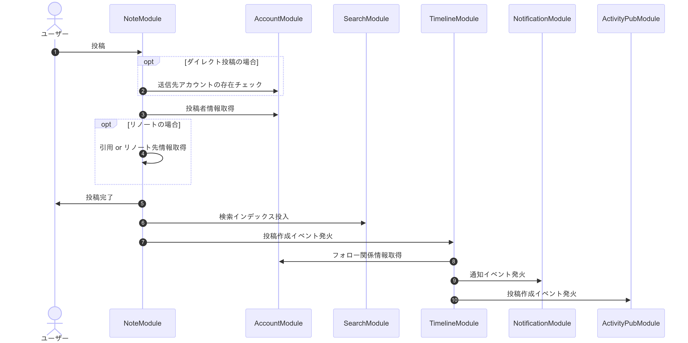
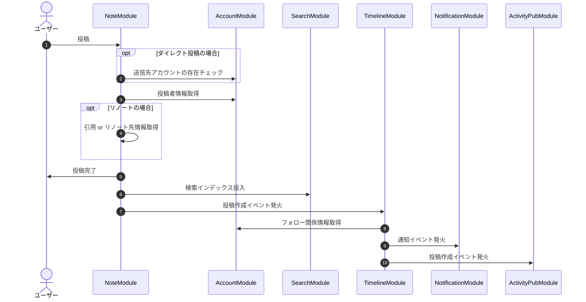

# 内部フロー・モジュール間通信



<details>

<summary>Mermaid code</summary>



</details>

## モジュールの概要

Pulsateのバックエンドでは"モジュール"と呼ばれる単位にプログラムを大まかに分け、機能や責任範囲を分離しています.\
現在時点でPulsateのバックエンドには以下のモジュールが存在しています.

### Note Module

- ノート(投稿)の作成を行う.
- ノートの削除を行う.
- ノート情報を返す.
- 投稿に紐づいたメディアの管理をする

### Account Module

- アカウント情報の管理を行う.
- アカウントを凍結/解除する.
- アカウントをサイレンスする.
- ログイン時に発行されるトークンの生成/検証を行う.
- アカウントのフォロー/フォロー解除を行う.

### Timeline Module

- (ホーム/リスト)タイムラインを構築する.
  - 特定のアカウントが見ることのできる投稿をフォロー関係と公開範囲から決定する.

### Drive Module

- メディアファイルの投稿を受け付ける
- メディアファイルを適切に圧縮する
- メディアファイル情報を返す
- メディアファイルの保存を行う

## モジュールの内部構造

モジュールの内部は以下のようになっています

```
.
├── adaptor/
│   ├── controller コントローラー
│   ├── presenter APIのエラー定義
│   ├── repository Repositoryの実装
│   └── validator APIスキーマ定義ファイル
├── model/
│   ├── errors.ts モジュール内で使うエラーの定義
│   ├── <moduleName>.ts モジュールで使うモデル
│   └── repository.ts RepositoryのInterface定義
├── service 実際の処理を行うApplication Serviceの実装
├── mod.ts APIのハンドラ (エントリーポイント)
└── router.ts APIのルーティング定義
```

処理の大まかな流れは以下の通りです

1. mod.ts がトップレベル(pkg/main.ts)から呼び出され、APIのリクエストを受ける
2. router.tsの定義に従ってmod.tsで定義されたハンドラーにリクエストの内容が渡される
3. adaptor/validatorで定義されたスキーマに沿ったリクエストかを判定する
4. ハンドラーからadaptor/controllerを呼び出す
5. controllerからserviceを呼び出す
6. serviceが処理を行い、model/repository.tsで定義されたInterfaceを呼び出し、データの取得や保存を行う
   1. Intermoduleパッケージを利用して他のモジュールの機能を呼び出して使うこともできる

## Intermoduleパッケージ (モジュール間通信)

モジュールは他のモジュールのServiceをimportすることは禁止されています.\
そのため, 他のモジュールの機能を利用したい場合には Intermodule
パッケージを利用します.\
Intermodule
パッケージはそれぞれのモジュールごとに定義されるインタフェースで、モジュールが他のモジュールから参照される機能を公開するようになっています.\
Intermodule
の内部ではそのモジュールのServiceのメソッドを呼び出すよう実装されています.
