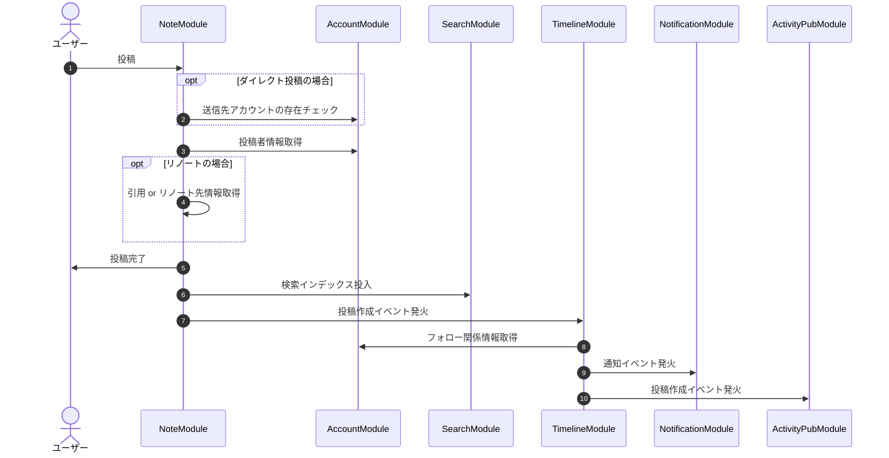

# 内部フロー・モジュール間通信

Mermaid code

## モジュールの概要

### Note Module

- ノート(投稿)の作成を行う.
- ノートの削除を行う.
- ノート情報を返す.

### Account Module

- アカウント情報の管理を行う.
- アカウントを凍結/解除する.
- アカウントをサイレンスする.

### Timeline Module

- タイムラインを構築する.
  - 特定のアカウントが見ることのできる投稿をフォロー関係と公開範囲から決定する.
- (ActivityPub 外部配送 / Push通知)の送信先アカウントを決定する.

### Notification Module

- クライアントに対してPush通知・メール通知を送信する.

### ActivityPub Module

- ActivityPubを経由した外部サーバーへのノート配送を行う.
- ActivityPubを経由したノートの受信を行う.
