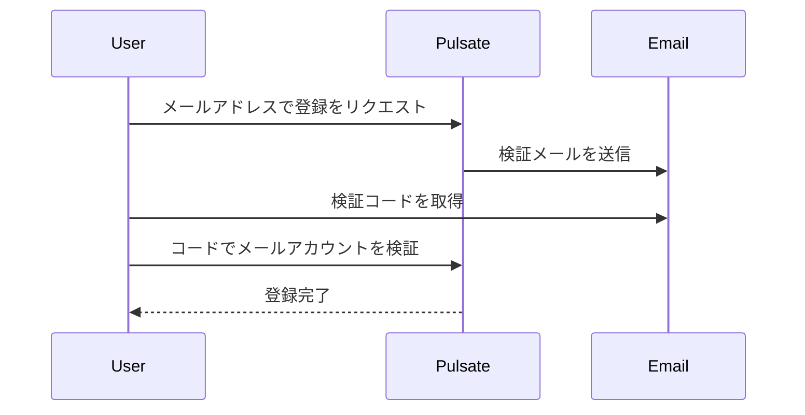
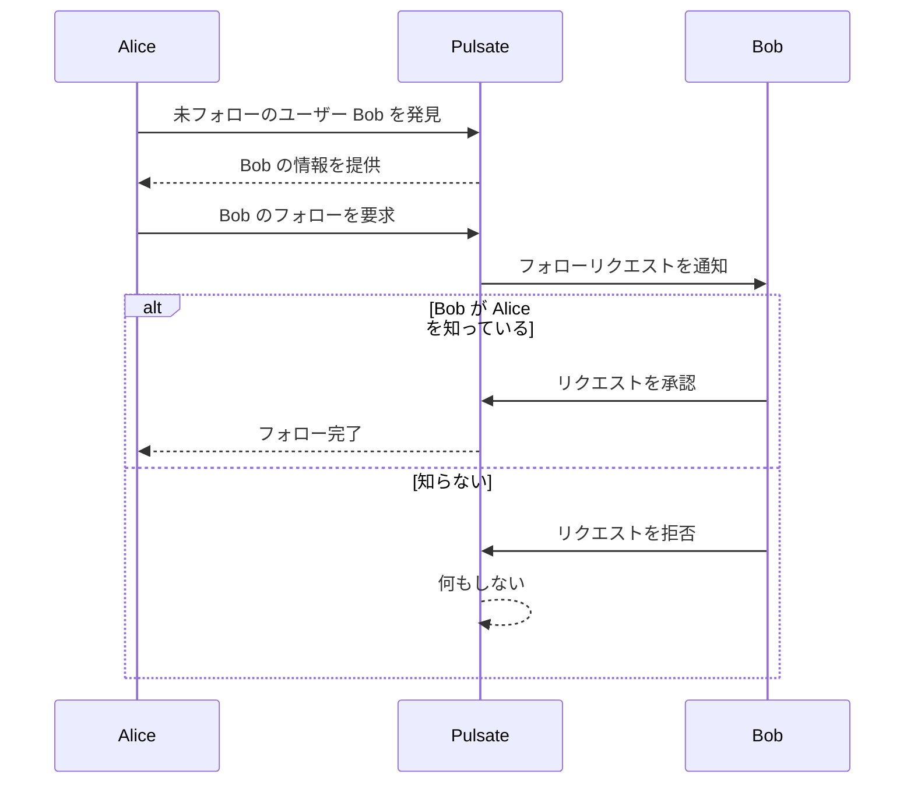
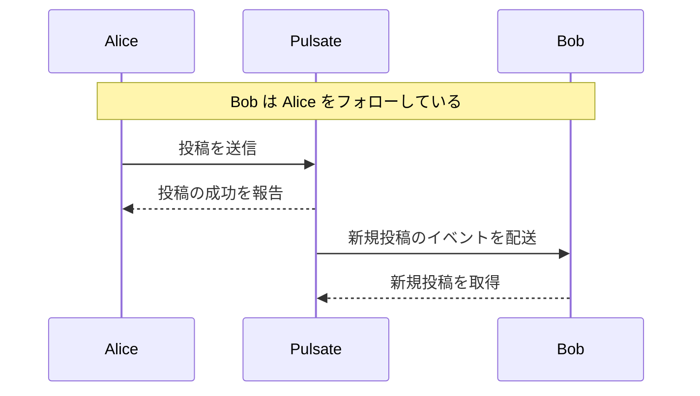

# ユーザーストーリー

この文書は, Pulsate プロジェクトの主要成果物である分散型 SNS
サーバーソフトウェア `pulsate` がエンドユーザーから見たときに `pulsate`
以外の外部システムも含めてどのように振る舞うべきかを定義する.

`pulsate` はいくつかのアクターとやり取りすることを想定している. そのため,
ユーザーストーリーで登場するアクターを以下のように定義する.

- ユーザー User: `pulsate` がやり取りするなかで最も一般的な, SNS
  サービスを享受するエンドユーザー.
  - 別々の User を表すとき, メタ変数として Alice と Bob を用いる.
- モデレーター Moderator: `pulsate`
  およびその上で運営されるコミュニティを管理するエンドユーザー. Moderator is-a
  User の関係にある.

各ユーザーストーリーは, 他文書から参照しやすいように ID を割り振っている. ID
の文法構造は `US<2桁の連番>` としている (US は User Story の略).

## US01: ユーザー登録

- 事前条件: そのユーザーが保持するメールアドレスのアカウントが登録されていない.
- 事後条件: そのユーザーが保持するメールアドレスのアカウントが登録されている.
- 主要シナリオ:
  1. ユーザーが Pulsate へ,
     メールアドレスを付けて新規登録したいことをリクエストする.
  2. Pulsate がメールアドレスのメールアカウントへ, 検証メールを送信する.
  3. ユーザーがそのメールアカウントのメールサービスへ問い合わせて,
     検証メールが来たことを確かめる.
  4. 検証メールの内容の検証コードを取得し,
     そのコードを付けて新規登録したいことをリクエストする.
  5. Pulsate がユーザへ, 新規登録に成功したことを応答する.
- 3 で検証メールが届かなかったときの代替シナリオ:
  1. ユーザーが検証メールの再送信をリクエストする.
  2. Pulsate がメールアドレスのメールアカウントへ, 検証メールを送信する.
  3. これで届けば主要シナリオの 4 へ遷移する. 届いていなければ,
     この代替シナリオの 1 へ遷移する, あるいはユーザー登録を中止する.
- 5 で新規登録に失敗したときの例外シナリオ:
  1. Pulsate がユーザへ, 新規登録に失敗したことを応答する.
     このユーザー登録を中止する.
- 制約:
  - 短時間に大量のユーザー登録がリクエストされた時に,
    メール送信サービスのレートリミットに引っかかる可能性が高い.

## US02: フォロー/フォロワー

- 事前条件: Alice と Bob が Pulsate 上でユーザー登録を完了している. Alice が Bob
  をフォローしていない.
- 事後条件: Alice が Bob をフォローしている.
- 主要シナリオ:
  1. Alice が Pulsate 上で, 未フォローのユーザー Bob の投稿を発見する.
  2. Alice が Pulsate に, 未フォローのユーザー Bob
     のアカウント情報を問い合わせる.
  3. Pulsate が Alice へ, Bob の情報を提供する.
  4. Alice が Pulsate に, Bob
     をフォローの対象として追加することをリクエストする.
  5. Pulsate が, Alice から Bob へのフォローリクエストを記録する.
  6. Pulsate が Bob へ, Alice からのフォローリクエストを通知する.
  7. Bob が Pulsate 上で, そのフォローリクエストを承認する.
  8. Pulsate が, Alice から Bob へフォローの関係があることを記録する.
  9. Pulsate が Alice へ, フォローリクエストが承認されたことを通知する.
- 7 で Bob が承認しなかった場合の代替シナリオ:
  1. Pulsate は Alice から Bob へのフォローリクエストを記録し続けて何もしない.
- 4 でフォロー対象にできない場合の例外シナリオ:
  1. Pulsate が Alice へ, Bob をフォローできないことを応答する.

## US03: 投稿

- 事前条件: Bob が Pulsate 上でユーザー登録を完了している. Bob が Alice
  をフォローしている.
- 事後条件: Alice が作成した新たな投稿が, Bob のホームタイムラインに現れる.
- 主要シナリオ:
  1. Alice が Pulsate へ, 新規投稿の作成をリクエストする.
  2. Pulsate が新規の投稿を記録する.
  3. Pulsate が Alice へ, 投稿の作成に成功したことを応答する.
  4. Pulsate が Bob のタイムラインへ非同期で追加する.
  5. Bob が Pulsate 上で自身のタイムラインを取得する.
- 2 で新規の投稿の作成に失敗した場合の例外シナリオ:
  1. Pulsate が Alice へ, 投稿の作成に失敗したことを応答する.
- 制約:
  - あるユーザーのフォローされているユーザー数が非常に多い時,
    そのユーザーが投稿した際にそのユーザーをフォローしているユーザーのホームタイムラインすべてを生成する処理に負荷が集中する可能性が高い.
  - Alice は Pulsate 内ではない, 外部の分散型 SNS
    サービスからの連合と呼ばれる機能で新規投稿を Pulsate
    へ転送していることがある.

## US04: ブックマーク (お気に入り)

- 事前条件: ユーザーが Pulsate 上でユーザー登録を完了している.
  ユーザーがその投稿をブックマークしていない.
- 事後条件: ユーザーがその投稿をブックマークしている.
- 主要シナリオ:
  1. ユーザーが Pulsate 上で投稿を発見する.
  2. ユーザーが Pulsate へ, その投稿をブックマークするようにリクエストする.
  3. Pulsate が, ユーザーがその投稿をブックマークしていることを非同期で記録する.
  4. ユーザーはブックマークに成功したと見なして Pulsate の利用を続行する.
- 3 で記録に失敗した場合の例外シナリオ:
  1. ユーザーが先程の投稿がブックマークされていないことに気づく.
  2. ユーザーが Pulsate へ, その投稿をブックマークするようにリクエストする.
- 制約:
  - ユーザーがある投稿をブックマークしているかどうかは,
    他のユーザーから秘匿しなければならない.
- 備考:
  - ブックマークに失敗したとき,
    後でその失敗を通知する仕組みをシナリオに組み込んだほうがよいかもしれない.

## US05: 検索

- 事前条件: なし (ユーザー登録なしで利用できる).
- 事後条件: なし (システムの状態を変化させない).
- 主要シナリオ:
  1. ユーザーが Pulsate へ, クエリ条件を送って検索を開始する.
  2. Pulsate がユーザーへ, 検索結果を応答する.
- 制約:
  - キャッシュや結果整合的非同期処理により,
    作成された投稿が検索結果へすぐには反映されないことがある.
  - 多くの複雑な検索に対して高速に処理できることが望ましい.
- 備考:
  - この検索のインターフェイスについては, SNS
    としてのユーザー体験を向上させるために熟考が必要である. 多機能,
    インタラクティブ性, 可読性,
    充実したヘルプといった要素を重視することが望ましい.
